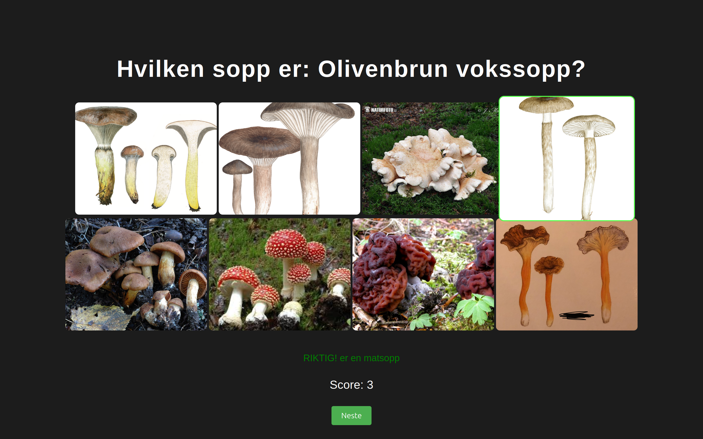
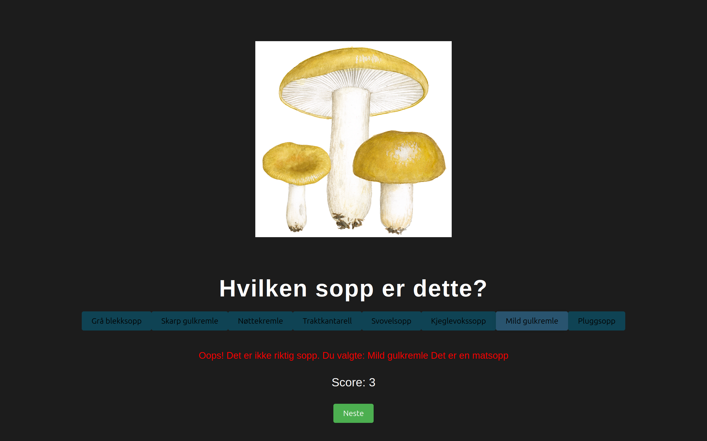

# Sopp

This is a mushroom app! The goal is to make learning about mushrooms both fun and educational. Through an interactive quiz, users can test their mushroom knowledge while earning points and climbing the leaderboard. Whether you're a beginner or a mushroom enthusiast, this game is a great way to discover fascinating facts about mushrooms while having fun!

## Question Type 1

At the moment the quiz has two types of question.

## Question Type 2

The second type of question is more practical because it mimics real-life situations where you encounter mushrooms in nature. Instead of relying on text, you'll need to visually identify and classify the mushrooms based on what you see, just like you would in the wild.

